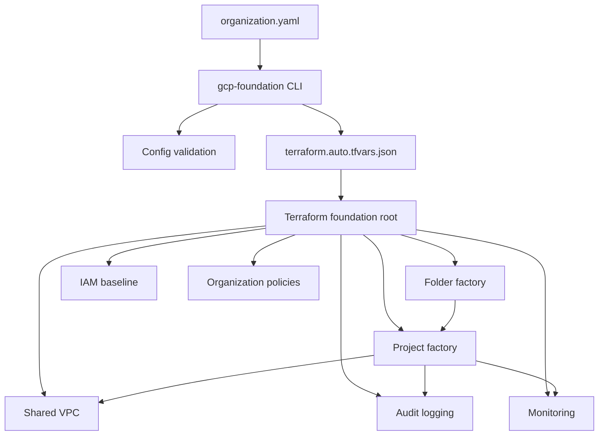

# gcp-foundation-platform

A production-style Google Cloud foundation platform built with Terraform and a Python automation CLI.

This repository is designed as an enterprise-grade starting point for building a secure GCP landing zone:

- organization folder structure,
- project factory,
- Shared VPC networking,
- baseline IAM bindings,
- organization policies,
- centralized audit logging,
- monitoring primitives,
- GitHub Actions CI/CD with Workload Identity Federation support,
- Python CLI for configuration validation, tfvars generation, inventory rendering, and Terraform orchestration.

> This project intentionally separates **configuration**, **Terraform modules**, and **Python automation**. That makes it easy to reuse the same foundation pattern across multiple organizations, environments, or demo accounts.

---

## Architecture



More details: [`docs/architecture.md`](docs/architecture.md).

---

## Repository layout

```text
gcp-foundation-platform/
├── config/                         # Organization configuration examples
├── docs/                           # Architecture, runbooks, ADRs
├── diagrams/                       # Mermaid architecture diagrams
├── scripts/                        # Helper scripts
├── src/gcp_foundation/             # Python automation CLI
├── terraform/
│   ├── foundation/                 # Root Terraform composition
│   └── modules/                    # Reusable GCP foundation modules
├── tests/                          # Unit tests for the Python CLI/config layer
├── .github/workflows/              # CI and Terraform workflows
├── Makefile
└── pyproject.toml
```

---

## What this project provisions

The Terraform layer contains modules for:

| Area | Module | Purpose |
|---|---|---|
| Resource hierarchy | `folder-factory` | Creates top-level folders under a GCP organization |
| Projects | `project-factory` | Creates projects, attaches billing, enables APIs |
| Networking | `shared-vpc` | Creates Shared VPC host networks, subnets, Cloud NAT |
| IAM | `iam-bindings` | Applies organization, folder, and project IAM members |
| Governance | `org-policies` | Applies boolean and list organization policies |
| Logging | `logging` | Creates audit log bucket and organization log sink |
| Monitoring | `monitoring` | Creates notification channels for a monitoring project |

---

## Requirements

Local development:

- Python 3.11+
- Terraform 1.15.x recommended
- Google Cloud CLI for local Application Default Credentials
- A GCP organization ID
- A billing account ID
- Permissions to create folders, projects, IAM bindings, organization policies, and log sinks

Recommended GitHub repository settings:

- branch protection enabled for `main`,
- required checks for Python tests and Terraform validation,
- environments for `dev`, `stage`, and `prod`,
- Workload Identity Federation instead of service account keys.

---

## Quick start

### 1. Create a virtual environment

```bash
python -m venv .venv
source .venv/bin/activate
python -m pip install --upgrade pip
python -m pip install -e '.[dev]'
```

### 2. Validate the example organization config

```bash
gcp-foundation validate-config --config config/example.organization.yaml
```

### 3. Generate Terraform variables

```bash
gcp-foundation generate-tfvars \
  --config config/example.organization.yaml \
  --output terraform/foundation/terraform.auto.tfvars.json
```

### 4. Render an inventory document

```bash
gcp-foundation inventory \
  --config config/example.organization.yaml \
  --output docs/generated/inventory.md
```

### 5. Run local checks

```bash
make test
make repo-check
```

### 6. Run Terraform manually

```bash
cd terraform/foundation
terraform init
terraform plan
```

For CI/CD usage, see [`docs/operations.md`](docs/operations.md).

---

## Python CLI commands

```bash
gcp-foundation validate-config --config config/example.organization.yaml
gcp-foundation generate-tfvars --config config/example.organization.yaml --output terraform/foundation/terraform.auto.tfvars.json
gcp-foundation inventory --config config/example.organization.yaml --output docs/generated/inventory.md
gcp-foundation check-repo --path .
gcp-foundation terraform --action plan --workdir terraform/foundation --var-file terraform.auto.tfvars.json --dry-run
```

The CLI is intentionally part of the project. A senior platform repository should not be only Terraform files; it should also include automation, guardrails, and operational tooling.

---

## Configuration model

The source of truth is a YAML file:

```yaml
organization_id: "123456789012"
billing_account: "000000-000000-000000"
default_region: europe-west1
labels:
  owner: platform
  managed_by: terraform
folders:
  platform:
    display_name: Platform
projects:
  foundation-host:
    project_id: example-foundation-host
    name: foundation-host
    folder: platform
    services:
      - compute.googleapis.com
      - dns.googleapis.com
```

Full example: [`config/example.organization.yaml`](config/example.organization.yaml).

---

## Safety guardrails

This repository intentionally includes safety defaults:

- project deletion policy defaults to `PREVENT`,
- default network creation is disabled in projects,
- service account key creation is disabled through an example org policy,
- Terraform state files and generated tfvars are ignored by Git,
- GitHub Actions use OIDC/Workload Identity Federation instead of static keys,
- local validation catches malformed project IDs, invalid CIDR ranges, broken folder references, and invalid network references before Terraform runs.

---

## Testing

```bash
make test
```

The tests validate:

- YAML config loading,
- Pydantic model validation,
- Terraform tfvars generation,
- Markdown inventory rendering,
- repository structure checks,
- Terraform command construction.

The tests do **not** require GCP credentials.

---

## Roadmap

See [`docs/roadmap.md`](docs/roadmap.md).

Planned next steps:

- add Terratest/integration test examples,
- add Cloud Asset Inventory reporting,
- add IAM recommender exports,
- add policy exception workflow,
- add multi-environment promotion pattern,
- publish Terraform module documentation with `terraform-docs`.

---

## License

MIT. See [`LICENSE`](LICENSE).
