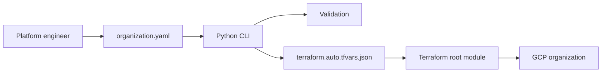

# Architecture

## Goal

`gcp-foundation-platform` provides an opinionated foundation for a Google Cloud organization. It focuses on repeatable, reviewable, and testable infrastructure provisioning.

## Design principles

1. **Configuration as product input** - the YAML file is the product interface.
2. **Terraform as the provisioning engine** - Terraform owns cloud resources.
3. **Python as the platform automation layer** - Python validates configuration and generates operational artifacts.
4. **Security by default** - project deletion protection, no default networks, no service account keys, centralized audit logging.
5. **CI-first workflow** - every pull request should run Python tests, Terraform formatting, and Terraform validation.

## High-level flow



## Terraform composition

The root module in `terraform/foundation` composes smaller modules:

```text
foundation
├── folder-factory
├── project-factory
├── shared-vpc
├── iam-bindings
├── org-policies
├── logging
└── monitoring
```

## Why Python CLI?

The Python CLI provides a clean operational interface:

- validate the YAML contract before Terraform runs,
- generate Terraform variables deterministically,
- render inventories for pull requests and audits,
- wrap Terraform commands consistently,
- make future policy checks easy to add.

This is the difference between a Terraform sample and a platform engineering repository.
